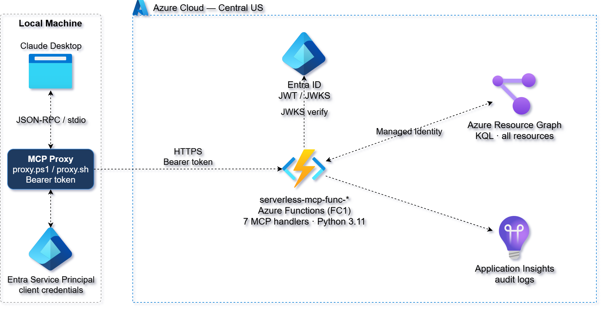
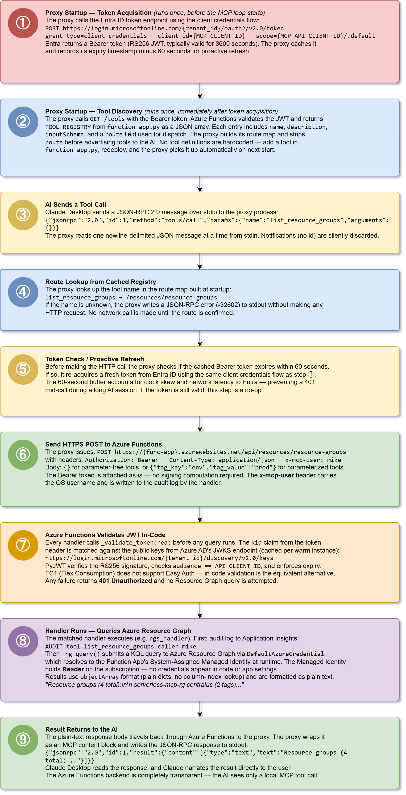

# Azure Serverless MCP — Resource Graph API

This project delivers a **serverless MCP (Model Context Protocol) backend** on
Azure that lets an AI assistant query Azure resource inventory in plain English.
Seven Azure Functions expose resource query tools behind an **HTTP API** secured
with **Entra ID Bearer token authentication**. A lightweight local proxy acquires
tokens and forwards MCP calls to the Function App, making the remote serverless
backend completely transparent to the AI caller.

It uses **Terraform** and **Python (azure-mgmt-resourcegraph)** to provision and
deploy the backend, and a **PowerShell or Bash proxy script** to bridge the MCP
stdio transport to the authenticated HTTP API.



This design follows a **serverless MCP architecture** where the AI thinks it is
talking to a local tool server, while all tool logic runs in Azure Functions
querying the Azure Resource Graph API. Entra ID enforces Bearer token
authentication on every route, and the proxy handles token acquisition and caching.

Key capabilities demonstrated:

1. **Serverless MCP Tools** – Seven Function-backed resource query tools exposed
   as a standard MCP tool server, invokable by any MCP-compatible AI client.
2. **Entra ID Bearer Auth** – All routes require a valid JWT validated in-code
   against Azure AD's JWKS endpoint. Unsigned requests are rejected before any
   query runs.
3. **Self-Configuring Proxy** – At startup the proxy calls `GET /tools`
   (authenticated) to load route mappings and tool schemas from the backend. No
   tool definitions are hardcoded in the proxy — add a tool in `function_app.py`,
   redeploy, and the proxy picks it up automatically on next start.
4. **Generic Proxy Pattern** – The proxy contains no tool-specific logic. Point
   it at a different `MCP_API_ENDPOINT` to get a completely different tool set.
5. **Managed Identity** – The Function App queries Resource Graph using a
   System-Assigned Managed Identity with `Reader` on the subscription. No
   credentials in code or app settings.
6. **Infrastructure as Code** – Terraform provisions all Functions, Entra app
   registrations, service plan, and RBAC assignments in a single apply.

Together, these components form a **reference architecture for serverless MCP
tool backends on Azure** — demonstrating how AI tools can be centrally deployed,
versioned, and secured without requiring local runtimes on the caller's machine.

## Prerequisites

* An Azure subscription
* [Install Azure CLI](https://learn.microsoft.com/en-us/cli/azure/install-azure-cli)
* [Install Terraform](https://developer.hashicorp.com/terraform/install)
* `jq` and `zip` in PATH (used by `apply.sh` and `validate.sh`)
* Service principal with Contributor rights for Terraform deployment
* Environment variables set:
  ```
  ARM_CLIENT_ID
  ARM_CLIENT_SECRET
  ARM_SUBSCRIPTION_ID
  ARM_TENANT_ID
  ```

## Download this Repository

```bash
git clone https://github.com/mamonaco1973/azure-serverless-mcp.git
cd azure-serverless-mcp
```

## Build the Code

Run [check_env](check_env.sh) to validate your environment, then run
[apply](apply.sh) to provision the infrastructure.

```bash
~/azure-serverless-mcp$ ./apply.sh
NOTE: Running environment validation...
NOTE: az found.
NOTE: terraform found.
NOTE: jq found.
NOTE: zip found.
NOTE: Deploying Azure Functions infrastructure...
...
NOTE: Deployment complete.
```

### Build Results

When the deployment completes, the following resources are created in the
`serverless-mcp-rg` resource group:

- **Core Infrastructure:**
  - Fully serverless — no VMs, containers, or VNet required
  - Single-phase Terraform deploy from the `01-functions` directory
  - FC1 (Flex Consumption) service plan — scales to zero when idle

- **Security & Auth:**
  - `serverless-mcp-api` Entra app registration — defines the token audience
  - `serverless-mcp-proxy` Entra service principal — identity the proxy authenticates as
  - JWT validated in-code (RS256, Azure AD JWKS) — FC1 does not support Easy Auth
  - Function App Managed Identity with `Reader` on the subscription for Resource Graph

- **Azure Functions:**
  - Eight Python 3.11 handlers in a single `function_app.py`
  - `GET /tools` — discovery endpoint; returns tool registry for proxy self-config
  - Seven `POST /resources/*` routes — one per MCP tool

- **MCP Proxy Scripts:**
  - `02-proxy/proxy.ps1` — Windows PowerShell proxy with Bearer token management
  - `02-proxy/proxy.sh` — Bash equivalent (Linux / macOS / Git Bash)
  - Both implement full MCP JSON-RPC 2.0 stdio transport with token caching and
    proactive refresh 60 seconds before expiry

- **Claude Desktop Integration:**
  - `apply.sh` generates `02-proxy/claude_desktop_config_ps1.json` and
    `02-proxy/claude_desktop_config_sh.json` directly from Terraform outputs —
    replace `REPLACE_WITH_ABSOLUTE_PATH` with your local path and copy to
    `%APPDATA%\Claude\claude_desktop_config.json`, then restart Claude Desktop

- **Automation & Validation:**
  - `apply.sh`, `destroy.sh`, `check_env.sh`, and `validate.sh` automate the
    full lifecycle — no manual portal steps required

---

## MCP Tools

The **Azure Resource MCP API** exposes seven tools through **Azure Functions**.
Four tools take no input parameters; three accept parameters to filter results.
All responses are plain-text summaries suitable for direct AI narration.

> All routes require a valid **Entra ID Bearer token** scoped to
> `{serverless-mcp-api-client-id}/.default`. The proxy acquires and caches this
> token automatically.

### Discovery Endpoint

The proxy calls `GET /tools` at startup to self-configure. `function_app.py`
returns `TOOL_REGISTRY` — the single source of truth for all tool metadata:

```json
[
  {
    "name": "list_virtual_machines",
    "description": "Lists all virtual machines in the subscription...",
    "inputSchema": { "type": "object", "properties": {}, "required": [] },
    "route": "/resources/virtual-machines"
  },
  ...
]
```

The proxy strips `route` before forwarding tool schemas to the AI.

### Tool Summary

| Tool | Route | Input | Description |
|------|-------|-------|-------------|
| `list_virtual_machines` | `POST /resources/virtual-machines` | none | All VMs with name, size, resource group, location |
| `list_resource_groups` | `POST /resources/resource-groups` | none | All resource groups with location and tag count |
| `count_resources_by_type` | `POST /resources/count-by-type` | none | Ranked count of all resource types in the subscription |
| `find_resources_by_tag` | `POST /resources/by-tag` | `tag_key`, `tag_value` | All resources matching a specific tag key/value pair |
| `list_public_ip_addresses` | `POST /resources/public-ips` | none | All public IPs with allocation method and location |
| `find_resources_by_resource_group` | `POST /resources/by-resource-group` | `resource_group` | All resources in a specific resource group |
| `find_resources_by_region` | `POST /resources/by-region` | `region` | All resources in a specific Azure region |

### Example Tool Responses

**`list_resource_groups`**
```
Resource groups (4 total):

  serverless-mcp-rg    centralus  (2 tags)
  NetworkWatcherRG     centralus
  mikes-solutions-org  westus
  youtube-tenant-rg    centralus
```

**`count_resources_by_type`**
```
Resources by type (11 total):

      5  microsoft.network/networkwatchers
      2  microsoft.operationalinsights/workspaces
      1  microsoft.web/sites
      1  microsoft.keyvault/vaults
      1  microsoft.storage/storageaccounts
      1  microsoft.insights/components
```

**`find_resources_by_region`** (with `region: "centralus"`)
```
Resources in centralus (8 total):

  serverless-mcp-ai        microsoft.insights/components    serverless-mcp-rg
  serverless-mcp-func-xxxx microsoft.web/sites              serverless-mcp-rg
  serverless-mcp-plan      microsoft.web/serverfarms        serverless-mcp-rg
  ...
```

---

### Request & Response Characteristics

| Endpoint | Method | Auth | Request Body | Response |
|----------|--------|------|--------------|----------|
| `/tools` | `GET` | Bearer JWT | none | JSON array of tool descriptors |
| `/resources/*` | `POST` | Bearer JWT | `{}` or `{"param": "value"}` | Plain-text human-readable summary |

---

## MCP Proxy Request Flow


