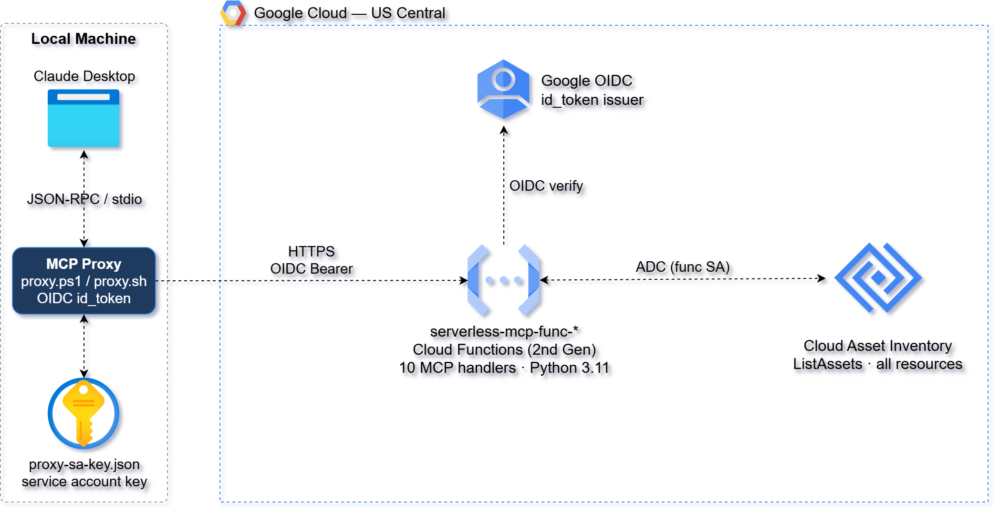
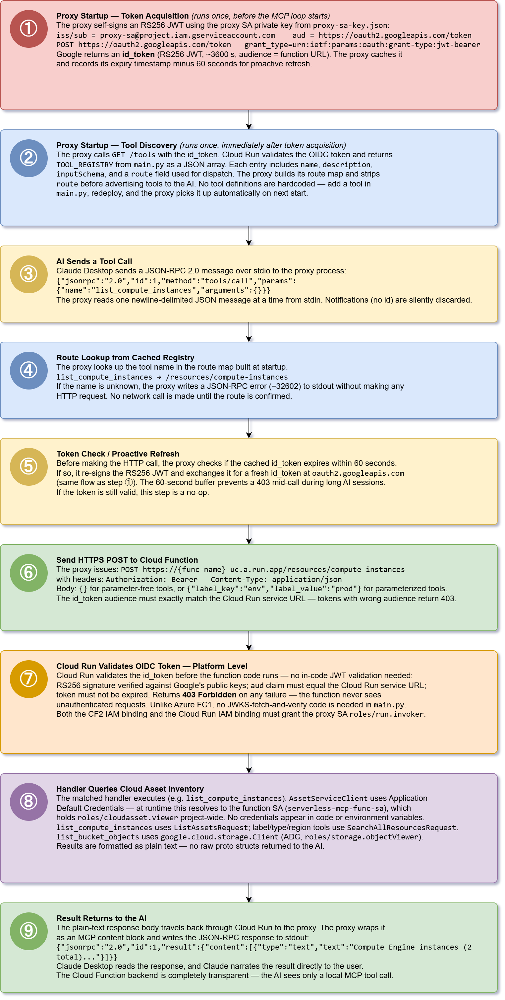

# GCP Serverless MCP — Cloud Asset Inventory API

This project delivers a **serverless MCP (Model Context Protocol) backend** on
GCP that lets an AI assistant query GCP resource inventory in plain English.
Ten Cloud Functions 2nd Gen handlers expose resource query tools behind an
**HTTP API** secured with **GCP OIDC authentication**. A lightweight local
proxy acquires OIDC tokens and forwards MCP calls to the Cloud Function,
making the remote serverless backend completely transparent to the AI caller.

It uses **Terraform** and **Python (google-cloud-asset, google-cloud-storage)**
to provision and deploy the backend, and a **PowerShell or Bash proxy script**
to bridge the MCP stdio transport to the authenticated HTTP API.

This design follows a **serverless MCP architecture** where the AI thinks it is
talking to a local tool server, while all tool logic runs in a Cloud Function
querying the GCP Cloud Asset Inventory API. Cloud Run IAM enforces OIDC token
authentication on every route, and the proxy handles token acquisition and
caching.



Key capabilities demonstrated:

1. **Serverless MCP Tools** – Ten Cloud Function-backed resource query tools
   exposed as a standard MCP tool server, invokable by any MCP-compatible AI
   client.
2. **GCP OIDC Auth** – All routes require a valid OIDC id_token validated at
   the Cloud Run platform level. The proxy SA key file signs a JWT that is
   exchanged for an id_token at the Google token endpoint.
3. **Self-Configuring Proxy** – At startup the proxy calls `GET /tools`
   (authenticated) to load route mappings and tool schemas from the backend.
   No tool definitions are hardcoded in the proxy — add a tool in `main.py`,
   redeploy, and the proxy picks it up automatically on next start.
4. **Generic Proxy Pattern** – The proxy contains no tool-specific logic. Point
   it at a different `MCP_API_ENDPOINT` to get a completely different tool set.
5. **ADC Function Identity** – The Cloud Function queries Cloud Asset Inventory
   using Application Default Credentials (its service account). No credentials
   in code or environment variables.
6. **Infrastructure as Code** – Terraform provisions all Cloud Functions,
   service accounts, IAM bindings, and source storage in a single apply.

Together, these components form a **reference architecture for serverless MCP
tool backends on GCP** — demonstrating how AI tools can be centrally deployed,
versioned, and secured without requiring local runtimes on the caller's machine.

## Prerequisites

* A GCP project
* [Install gcloud CLI](https://cloud.google.com/sdk/docs/install)
* [Install Terraform](https://developer.hashicorp.com/terraform/install)
* `jq` in PATH (used by `apply.sh` and `validate.sh`)
* `credentials.json` (GCP service account key) placed in the repo root
* Service account needs: Cloud Functions Admin, Cloud Run Admin,
  Cloud Build Editor, Artifact Registry Admin, IAM Admin,
  Cloud Asset Viewer, Storage Admin, Service Account Admin,
  Service Account Key Admin, Project IAM Admin

> **PowerShell proxy (`proxy.ps1`) requires PowerShell 7+** (`pwsh`).
> It uses `[System.Security.Cryptography.RSA]::ImportFromPem()` to load the
> service account private key, which is not available in Windows PowerShell 5.1.
> Install PowerShell 7 from https://aka.ms/powershell or via `winget install Microsoft.PowerShell`.
> On Linux/macOS use `proxy.sh` instead — it has no PowerShell dependency.

## Download this Repository

```bash
git clone https://github.com/mamonaco1973/gcp-serverless-mcp.git
cd gcp-serverless-mcp
```

Place your GCP service account key at `credentials.json` in the repo root.

## Build the Code

Run [check_env](check_env.sh) to validate your environment, then run
[apply](apply.sh) to provision the infrastructure.

```bash
~/gcp-serverless-mcp$ ./apply.sh
NOTE: Running environment validation...
NOTE: gcloud found.
NOTE: terraform found.
NOTE: jq found.
NOTE: Deploying GCP infrastructure...
...
NOTE: Validation complete — all 11 endpoints returned HTTP 200.
```

### Build Results

When the deployment completes, the following resources are created:

- **Core Infrastructure:**
  - Fully serverless — no VMs, containers, or VPC required
  - Single-phase Terraform deploy from the `01-functions` directory
  - Cloud Functions 2nd Gen (backed by Cloud Run) — scales to zero when idle

- **Security & Auth:**
  - `serverless-mcp-func-sa` — function service account with
    `roles/cloudasset.viewer` to query Cloud Asset Inventory and
    `roles/storage.objectViewer` to list bucket contents
  - `serverless-mcp-proxy-sa` — proxy service account with `roles/run.invoker`
    on the function; key exported to `02-proxy/proxy-sa-key.json`
  - OIDC id_token validated by Cloud Run platform — no in-code JWT validation
    needed (unlike the Azure variant which requires in-code JWKS validation
    due to FC1 Easy Auth limitations)

- **Cloud Function Handlers:**
  - Eleven Python 3.11 handlers in a single `main.py`
  - `GET /tools` — discovery endpoint; returns tool registry for proxy
    self-config
  - Ten `POST /resources/*` routes — one per MCP tool

- **MCP Proxy Scripts:**
  - `02-proxy/proxy.ps1` — Windows PowerShell 7+ proxy with OIDC token
    management
  - `02-proxy/proxy.sh` — Bash equivalent (Linux / macOS / Git Bash)
  - Both implement full MCP JSON-RPC 2.0 stdio transport with token caching and
    proactive refresh 60 seconds before expiry

- **Claude Desktop Integration:**
  - `apply.sh` generates `02-proxy/claude_desktop_config_ps1.json` and
    `02-proxy/claude_desktop_config_sh.json` directly from Terraform outputs —
    replace `REPLACE_WITH_ABSOLUTE_PATH` with your local path and copy to
    `%APPDATA%\Claude\claude_desktop_config.json`, then restart Claude Desktop

- **Automation & Validation:**
  - `apply.sh`, `destroy.sh`, `check_env.sh`, and `validate.sh` automate the
    full lifecycle — no manual console steps required

---

## MCP Tools

The **GCP Resource MCP API** exposes ten tools through a single Cloud
Function. Six tools take no input parameters; four accept parameters to
filter or target results. All responses are plain-text summaries suitable for
direct AI narration.

> All routes require a valid **GCP OIDC id_token** issued for the proxy service
> account. The proxy acquires and caches this token automatically.

### Discovery Endpoint

The proxy calls `GET /tools` at startup to self-configure. `main.py` returns
`TOOL_REGISTRY` — the single source of truth for all tool metadata:

```json
[
  {
    "name": "list_compute_instances",
    "description": "Lists all Compute Engine VM instances...",
    "inputSchema": { "type": "object", "properties": {}, "required": [] },
    "route": "/resources/compute-instances"
  },
  ...
]
```

The proxy strips `route` before forwarding tool schemas to the AI.

### Tool Summary

| Tool | Route | Input | Description |
|------|-------|-------|-------------|
| `list_compute_instances` | `POST /resources/compute-instances` | none | All VMs with name, machine type, zone, status |
| `list_storage_buckets` | `POST /resources/storage-buckets` | none | All GCS buckets with location and storage class |
| `count_resources_by_type` | `POST /resources/count-by-type` | none | Ranked count of all resource types in the project |
| `find_resources_by_label` | `POST /resources/by-label` | `label_key`, `label_value` | All resources matching a specific label key/value pair |
| `list_static_ip_addresses` | `POST /resources/static-ips` | none | All static external IPs with address, region, status |
| `find_resources_by_type` | `POST /resources/by-type` | `asset_type` | All resources of a specific GCP asset type |
| `find_resources_by_region` | `POST /resources/by-region` | `region` | All resources in a specific GCP region or zone |
| `describe_resource` | `POST /resources/describe` | `resource_name` | Full configuration detail for a named resource |
| `list_cloud_functions_detail` | `POST /resources/cloud-functions` | none | All Cloud Functions with runtime, memory, URL, SA, env vars |
| `list_bucket_objects` | `POST /resources/bucket-objects` | `bucket_name` | All objects in a GCS bucket with size and last-modified |

### Example Tool Responses

**`list_compute_instances`**
```
Compute Engine instances (2 total):

  my-web-server                   n2-standard-2             us-central1-a             RUNNING
  my-worker-vm                    e2-medium                 us-east1-b                TERMINATED
```

**`count_resources_by_type`**
```
Resources by type (14 total):

      4  compute.googleapis.com/Firewall
      2  compute.googleapis.com/Instance
      2  storage.googleapis.com/Bucket
      2  compute.googleapis.com/Network
      1  cloudfunctions.googleapis.com/CloudFunction
      ...
```

**`find_resources_by_region`** (with `region: "us-central1"`)
```
Resources in us-central1 (5 total):

  serverless-mcp-func-xxxx        cloudfunctions.googleapis.com/CloudFunction  us-central1
  my-web-server                   compute.googleapis.com/Instance              us-central1-a
  serverless-mcp-src-xxxx         storage.googleapis.com/Bucket                us-central1
  ...
```

---

### Request & Response Characteristics

| Endpoint | Method | Auth | Request Body | Response |
|----------|--------|------|--------------|----------|
| `/tools` | `GET` | OIDC id_token | none | JSON array of tool descriptors |
| `/resources/*` | `POST` | OIDC id_token | `{}` or `{"param": "value"}` | Plain-text human-readable summary |

---

## MCP Proxy Request Flow

